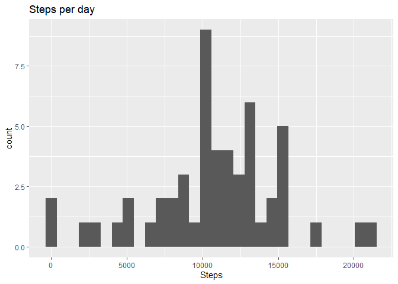
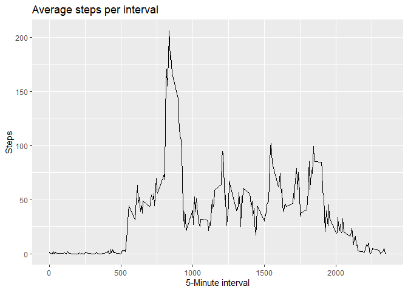
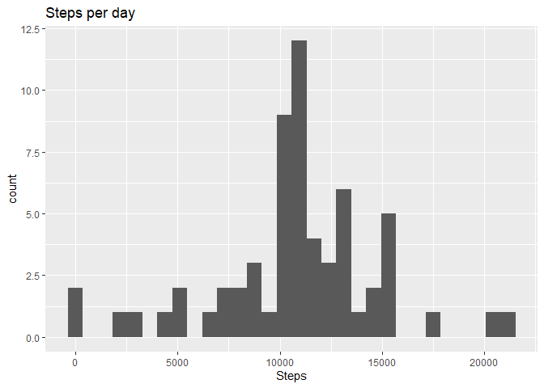
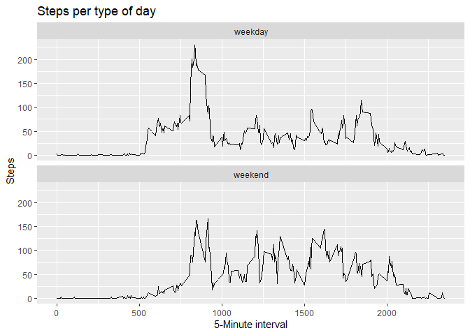

## Loading and preprocessing the data

1. Load the data


```r
library(dplyr)
```

```
## 
## Attaching package: 'dplyr'
```

```
## The following objects are masked from 'package:stats':
## 
##     filter, lag
```

```
## The following objects are masked from 'package:base':
## 
##     intersect, setdiff, setequal, union
```

```r
library(ggplot2)
library(lubridate)
```

```
## 
## Attaching package: 'lubridate'
```

```
## The following objects are masked from 'package:base':
## 
##     date, intersect, setdiff, union
```

```r
unzip('activity.zip')

rawData <- read.csv('activity.csv')
```

2. Converting 2nd column to date format

```r
rawData$date <- as.POSIXct(rawData$date, format = '%Y-%m-%d')
```


## What is mean total number of steps taken per day?

1. Calculate the total number of steps taken per day

```r
data1 <- group_by(rawData[complete.cases(rawData), ], date) %>% 
  summarise(steps = sum(steps, na.rm = T), .groups = 'keep')
```

2. Make a histogram of the total number of steps taken each day


```r
ggplot(data1, aes(x = steps)) +
  geom_histogram() + labs(x = 'Steps', title = 'Steps per day' )
```

```
## `stat_bin()` using `bins = 30`. Pick better value with `binwidth`.
```

<!-- -->

3. Calculate and report the mean and median of the total number of steps taken per day


```r
meanSteps <- mean(data1$steps)
medianSteps <- median(data1$steps)
options(scipen=999, digits = 2) #no scientific value and 2 decimals
```
Mean of the total number of steps taken per day = 10766.19

Median of the total number of steps taken per day = 10765


## What is the average daily activity pattern?

1. Make a time series plot of the 5-minute interval (x-axis) and the average 
number of steps taken, averaged across all days (y-axis)


```r
data2 <- group_by(rawData, interval) %>% 
  summarise(mean = mean(steps, na.rm = T), .groups = 'keep')

ggplot(data2, aes(x = interval, y = mean)) +   geom_line() +
  labs(x = '5-Minute interval', y = 'Steps', title = 'Average steps per interval')
```

<!-- -->


2. Which 5-minute interval, on average across all the days in the dataset, contains the maximum number of steps?

```r
max2 = data2[which.max(data2$mean),]
```
The 835th interval contains on average the maximum number of steps (206.17 steps)

## Imputing missing values

1. Calculate and report the total number of missing values in the dataset 


```r
missValues <- sum(is.na(rawData))
```
The total number of missing values is: 2304


2. Devise a strategy for filling in all of the missing values in the dataset. 

Using average steps per interval to fill in the missing values in the dataset


```r
interval3 <- group_by(rawData, interval) %>% summarise(mean = mean(steps, na.rm = T), .groups = 'keep')
```


3. Create a new dataset that is equal to the original dataset but with the missing data filled in.

rawData is merged with interval3, then NA values in step column are replace with the average steps, 
then data3 is rearranged so it looks like the original dataset.

```r
data3 <- merge(rawData, interval3, by = 'interval')
data3[is.na(data3$steps),]$steps <- data3[is.na(data3$steps),]$mean
data3 <- data3[,c('steps','date','interval')]
data3 <- arrange(data3, date)
```

4. Make a histogram of the total number of steps taken each day and Calculate and
report the mean and median total number of steps taken per day. Do these values 
differ from the estimates from the first part of the assignment? What is the 
impact of imputing missing data on the estimates of the total daily number of steps?


```r
data3byday <- group_by(data3, date) %>% summarise(steps = sum(steps), .groups = 'keep')

ggplot(data3byday, aes(x = steps)) + geom_histogram() + 
  labs(x = 'Steps', title = 'Steps per day' )
```

```
## `stat_bin()` using `bins = 30`. Pick better value with `binwidth`.
```

<!-- -->

```r
mean3 <- mean(data3byday$steps)
median3 <- median(data3byday$steps)
```
Mean of the total number of steps taken per day = 10766.19

Median of the total number of steps taken per day = 10766.19

Although the distribution has changed a little, the mean and median are nearly identical
to the estimates of the first part of the assignment


## Are there differences in activity patterns between weekdays and weekends?

1. Create a new factor variable in the dataset with two levels – “weekday” and 
“weekend” indicating whether a given date is a weekday or weekend day.


```r
data4 <- data3
data4$type<- ifelse(wday(data4$date) %in% c(2:6), 'weekday', 'weekend')
```

2. Make a panel plot containing a time series plot of the 5-minute interval (x-axis) 
and the average number of steps taken, averaged across all weekday days or weekend days (y-axis). 


```r
data4byday <- group_by(data4, type, interval) %>% summarise(steps = mean(steps), .groups = 'keep')

ggplot(data4byday, aes(x = interval, y = steps)) + geom_line() +
  facet_wrap(type ~ ., ncol = 1, nrow = 2)+ labs(x = '5-Minute interval', y = 'Steps', title = 'Steps per type of day' )
```

<!-- -->

There's a decrease in the average number of steps for the weekends


